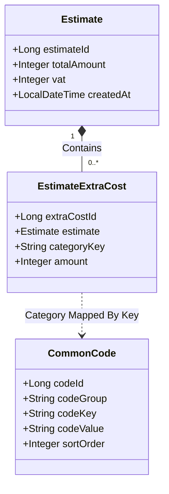

# 공통 코드(CommonCode) 관리 CRUD 화면 추가 및 견적 동적 경비 연계 계획서 (2차 보완)

> [!NOTE]
> 본 계획서는 견적 경비 마스터 데이터를 관리하기 위해 **공통 코드 관리 CRUD 화면**을 `MasterData.tsx`에 신설하고, 여기서 관리되는 데이터를 바탕으로 견적 추가 비용을 실시간 반영하도록 설계된 종합 구현 계획안입니다.

## 1. 아키텍처 설계 방향



- **공통 코드 CRUD 화면 신설**: 마스터 데이터 관리 페이지인 `/master` 내에 **네 번째 탭(공통 코드 관리)**을 추가하여 관리자가 코드 그룹(`codeGroup`), 코드 키(`codeKey`), 표시 명칭(`codeValue`), 정렬 순서(`sortOrder`)를 직접 제어할 수 있게 구현합니다.
- **동적 연동**: 관리 화면에서 수정한 공통 코드 리스트는 백엔드 DB를 거쳐, 견적서 작성 화면(`EstimateBuilder.tsx`)의 경비 입력 폼과 PDF 견적서 출력 레이아웃에 실시간 동적 갱신되어 반영됩니다.

---

## 2. 제안된 변경 사항

### [Component: Backend Domain & Data Access Layer]

#### [NEW] [CommonCode.java](file:///c:/Users/oem/Desktop/interior/backend/src/main/java/com/prodev/interior/domain/CommonCode.java)
- 공통 코드를 영속화하기 위한 H2/MariaDB 테이블 매핑
- 필드: `codeId` (PK), `codeGroup`, `codeKey`, `codeValue`, `sortOrder`, `isSystem`
- 수정 메소드: `public void updateCode(String codeGroup, String codeKey, String codeValue, Integer sortOrder)` 추가

#### [NEW] [EstimateExtraCost.java](file:///c:/Users/oem/Desktop/interior/backend/src/main/java/com/prodev/interior/domain/EstimateExtraCost.java)
- 견적서의 세부 경비 항목을 담는 테이블
- 필드: `extraCostId` (PK), `estimate` (ManyToOne), `categoryKey` (String, 공통코드 매핑), `amount` (Integer)

#### [MODIFY] [Estimate.java](file:///c:/Users/oem/Desktop/interior/backend/src/main/java/com/prodev/interior/domain/Estimate.java)
- 세금 항목인 부가세 `private Integer vat;` 컬럼 추가
- 세부 경비 연관 관계 추가: `@OneToMany(mappedBy = "estimate", cascade = CascadeType.ALL)` 명시

#### [NEW] [CommonCodeRepository.java](file:///c:/Users/oem/Desktop/interior/backend/src/main/java/com/prodev/interior/repository/CommonCodeRepository.java)
- `findByCodeGroupOrderBySortOrderAsc` 및 전체 조회 지원

#### [NEW] [EstimateExtraCostRepository.java](file:///c:/Users/oem/Desktop/interior/backend/src/main/java/com/prodev/interior/repository/EstimateExtraCostRepository.java)
- 견적 세부 경비 영속용 JPA 리포지토리

---

### [Component: Backend Service & API Controller Layer]

#### [NEW] [CommonCodeDTO.java](file:///c:/Users/oem/Desktop/interior/backend/src/main/java/com/prodev/interior/dto/CommonCodeDTO.java)
- 공통 코드 전송용 DTO 객체 생성

#### [NEW] [CommonCodeService.java](file:///c:/Users/oem/Desktop/interior/backend/src/main/java/com/prodev/interior/service/CommonCodeService.java)
- 공통 코드 CRUD 비즈니스 로직 작성

#### [NEW] [CommonCodeController.java](file:///c:/Users/oem/Desktop/interior/backend/src/main/java/com/prodev/interior/controller/CommonCodeController.java)
- 공통 코드 CRUD 엔드포인트 제공
  - `GET /api/common-codes`: 전체 공통 코드 리스트
  - `GET /api/common-codes/group/{group}`: 그룹별 필터링 조회
  - `POST /api/common-codes`: 신규 공통 코드 등록
  - `PUT /api/common-codes/{codeId}`: 기존 공통 코드 수정
  - `DELETE /api/common-codes/{codeId}`: 기존 공통 코드 삭제

#### [MODIFY] [EstimateCreateRequest.java](file:///c:/Users/oem/Desktop/interior/backend/src/main/java/com/prodev/interior/dto/EstimateCreateRequest.java)
- DTO 수정:
  ```java
  private Integer vat;
  private List<ExtraCostRequest> extraCosts;

  @Data
  public static class ExtraCostRequest {
      private String categoryKey;
      private Integer amount;
  }
  ```

#### [MODIFY] [EstimateResponse.java](file:///c:/Users/oem/Desktop/interior/backend/src/main/java/com/prodev/interior/dto/EstimateResponse.java)
- DTO 수정: `vat` 단일 컬럼 및 `List<ExtraCostResponse> extraCosts` 응답 객체 바인딩

#### [MODIFY] [EstimateService.java](file:///c:/Users/oem/Desktop/interior/backend/src/main/java/com/prodev/interior/service/EstimateService.java)
- `createEstimate`: 자재 단가 총합 산출 후, 전달받은 `extraCosts`를 순회하며 데이터베이스에 저장하고, 각 경비 금액 및 `vat` 세금을 누적하여 최종 `Estimate` 마스터의 `totalAmount` 산정.
- DTO 변환부(`convertToResponse`)에서 추가 경비 상세 내역을 함께 패킹하여 반환.

#### [MODIFY] [DummyDataLoader.java](file:///c:/Users/oem/Desktop/interior/backend/src/main/java/com/prodev/interior/config/DummyDataLoader.java)
- 초기 어플리케이션 로딩 시 `EST_EXTRA_COST_TYPE` 그룹에 해당하는 6종 공통 코드(`DEMOLITION`, `TRANSPORT`, `PROTECTION`, `FACILITY`, `OVERHEAD`, `PROFIT`) 자동 세팅 및 데이터베이스 적재.

---

### [Component: Frontend Web Application Layer]

#### [NEW] [commonCodeApi.ts](file:///c:/Users/oem/Desktop/interior/frontend/src/api/commonCodeApi.ts)
- 공통 코드 CRUD 통신 기능 추가 (`fetchCommonCodes`, `createCommonCode`, `updateCommonCode`, `deleteCommonCode`)

#### [MODIFY] [estimateApi.ts](file:///c:/Users/oem/Desktop/interior/frontend/src/api/estimateApi.ts)
- `EstimateCreateRequest` 및 `EstimateResponse` DTO 인터페이스에 `vat` 및 `extraCosts` 동적 구조 매핑

#### [MODIFY] [MasterData.tsx](file:///c:/Users/oem/Desktop/interior/frontend/src/pages/MasterData.tsx)
- **탭 추가**: 네 번째 탭인 `공통코드 관리` 신설 (`Tab = 'material' | 'vendor' | 'process' | 'common-code'`)
- **CRUD 인터페이스**: 공통 코드 목록 테이블, 생성/수정/삭제 모달 폼 제공
- 관리자 권한 여부 체크(ADMIN일 때만 저장/삭제 허용) 적용

#### [MODIFY] [EstimateBuilder.tsx](file:///c:/Users/oem/Desktop/interior/frontend/src/pages/EstimateBuilder.tsx)
- **동적 UI 생성**:
  - `EST_EXTRA_COST_TYPE` 공통 코드를 로드하여 `철거비`, `운반비` 등의 인풋 폼을 동적으로 화면에 출력. (하드코딩 없음)
  - 사용자가 각 추가 경비에 금액을 입력하면 실시간으로 장바구니 총 자재비와 결합하여 즉시 총액을 동적으로 합산 연산.
  - 부가세(VAT) 연산 체크박스 제공 (체크 시 자재비+추가경비의 10% 자동 계산 및 폼 셋업)
- **PDF 출력 동적 렌더링**:
  - A4 PDF 견적서 하단에 입력된 추가 경비들을 루프를 돌며 항목명(Value)과 금액을 영수증 형태로 동적으로 맞춰 인쇄.

---

## 3. 검증 계획

### 1. 자동화 빌드 검사
- Java 17 환경 빌드 및 컴파일 검증 (`./gradlew compileJava`)
- Frontend 빌드 번들 패킹 검증 (`npm run build`)

### 2. 수동 동작 테스트
- 마스터 관리 화면의 `공통코드 관리` 탭에서 신규 비용 구분(예: `COMMUNICATION` - 통신/소음 민원비)을 새로 등록.
- 스마트 견적서 작성 화면으로 이동하여, 새로 등록한 `통신/소음 민원비` 인풋 박스가 자동으로 렌더링되는지 확인.
- 철거비 및 새로 등록한 민원비 입력 후 저장 및 PDF를 인쇄해 동적으로 모든 추가 경비 리스트가 잘 출력되는지 대조 검증.
