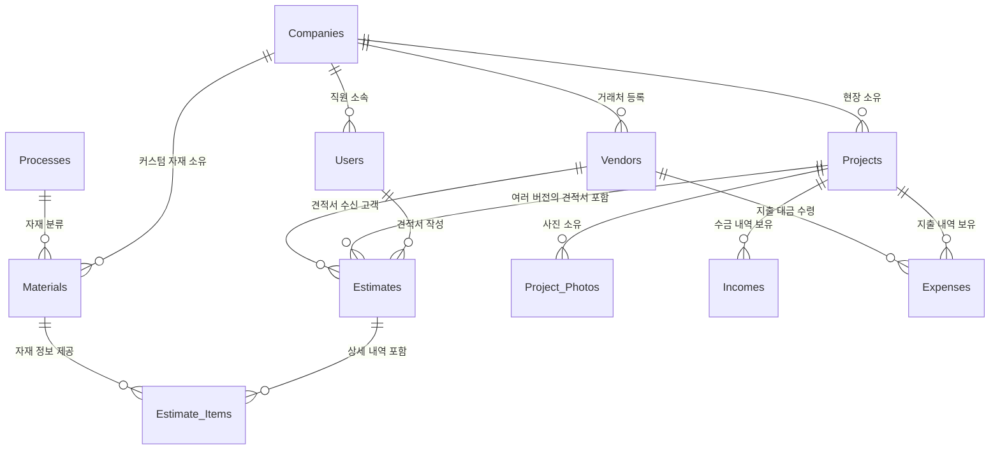

# 2026-06-28 작성자: PROCPA

# [DB 설계안] 하이브리드 인테리어 관리 시스템 데이터베이스 모델링

## 1. 개요
본 문서는 소상공인 및 소규모 인테리어 업체를 위한 하이브리드 견적/관리 시스템의 핵심 데이터베이스(DB) 테이블 구조와 관계(PK/FK)를 정의합니다. 확장이 용이한 관계형 데이터베이스(RDBMS)를 기준으로 설계되었으며, 사장과 직원이 함께 사용하는 멀티 테넌트(Multi-Tenant) 환경 및 권한 관리를 지원합니다.

## 2. 전체 핵심 테이블 구성 (총 11개)
권한 분리를 위해 기존의 단일 사용자 테이블을 **[회사]** 와 **[직원 계정]** 으로 세분화하고, 수익 분석을 위한 **[정산 영역]** 과 통합 매입 관리를 위한 **[거래처 마스터]** 를 추가하여 총 11개의 테이블로 구성합니다.

### 2.1. 조직 및 사용자 관리 영역 (수정됨)
**1. Companies (회사/조직 테이블 - 신규)**
- 인테리어 업체의 사업자 정보와 시스템 구독 요금제를 관리합니다. (이 정보가 견적서 발행 시 상단에 출력됩니다.)
- `company_id` (PK) : 회사 고유 ID
- `company_name` : 상호명
- `representative_name` : 대표자명 (견적서 출력용)
- `business_number` : 사업자등록번호 (견적서 출력용)
- `address` : 사업장 소재지 주소 (견적서 출력용)
- `contact_number` : 대표 연락처 (견적서 출력용)
- `subscription_plan` : 시스템 구독 요금제 (Lite, Standard, Premium 등)

**2. Users (사용자/직원 계정 테이블 - 변경)**
- 회사에 소속된 개별 작업자(사장, 직원)의 로그인 계정입니다.
- `user_id` (PK) : 사용자 고유 ID
- `company_id` (FK) : 소속된 회사 ID (Companies 테이블 참조)
- `email` : 로그인 이메일
- `password` : 암호화된 비밀번호
- `role` : 권한 등급 (예: ADMIN=사장, STAFF=일반 직원)

### 2.2. 현장 관리 영역
**3. Projects (현장/프로젝트 테이블)**
- 회사가 수주한 개별 공사 현장 정보를 담습니다. (이제 개인이 아닌 회사에 종속됩니다.)
- `project_id` (PK) : 현장 고유 ID
- `company_id` (FK) : 담당 업체 ID (Companies 테이블 참조)
- `project_name` : 현장명 (예: 서초 래미안 32평 리모델링)
- `address` : 현장 주소
- `status` : 진행 상태 (견적중, 공사중, 정산완료)
- `start_date`, `end_date` : 공사 기간

**4. Project_Photos (현장 사진 테이블)**
- 클라우드에 업로드된 현장 비포/애프터 사진을 관리합니다. (파일명 중복 방지 로직 적용)
- `photo_id` (PK) : 사진 고유 ID
- `project_id` (FK) : 해당 현장 ID (Projects 테이블 참조)
- `process_id` (FK) : 관련 공정 ID (Processes 테이블 참조)
- `original_file_name` : 사용자가 올린 원본 파일명 (예: IMG_1234.jpg)
- `stored_file_name` : 중복 방지를 위해 UUID로 변환된 시스템 저장 파일명
- `image_url` : 클라우드 스토리지 최종 접근 경로

### 2.3. 자재 및 공정 마스터 영역
**5. Processes (공정 분류 테이블)**
- 철거, 목공, 도배 등 작업 공정을 분류합니다.
- `process_id` (PK) : 공정 고유 ID
- `process_name` : 공정명
- `sort_order` : 견적서 정렬 순서

**6. Materials (자재 마스터 테이블)**
- 자재의 단가와 '단위 환산 로직'을 담는 핵심 테이블입니다.
- `material_id` (PK) : 자재 고유 ID
- `process_id` (FK) : 속한 공정
- `company_id` (FK) : NULL일 경우 시스템 공통 자재, 값이 있으면 해당 회사만의 커스텀 자재
- `material_name` : 자재명
- `standard_unit` : 기준 단위 (㎡)
- `distribution_unit` : 유통 단위 (Roll, Box 등)
- `conversion_rate` : 단위 환산 비율 (핵심 로직)
- `purchase_price` : 매입 단가 (실행가 기준)
- `labor_price` : 기본 인건비(품)

### 2.4. 견적 및 정산 영역
**7. Estimates (견적서 마스터 테이블)**
- 한 현장에서 발행되는 여러 차수의 견적서를 관리합니다.
- `estimate_id` (PK) : 견적서 고유 ID
- `project_id` (FK) : 해당 현장 ID
- `client_vendor_id` (FK) : 견적서를 받는 고객(수금 거래처) ID (Vendors 테이블 참조, 출력용)
- `author_user_id` (FK) : 해당 견적서를 작성한 직원 ID (Users 테이블 참조)
- `version` : 견적 차수
- `is_final` : 최종 계약 여부
- `total_amount` : 총 견적 금액

**8. Estimate_Items (견적 상세 내역 테이블)**
- 단위 환산기와 투트랙 로직이 기록되는 견적 상세 항목입니다.
- `item_id` (PK) : 내역 고유 ID
- `estimate_id` (FK) : 속한 견적서 ID
- `material_id` (FK) : 사용된 자재 ID
- `input_area` : 입력 면적 (㎡)
- `calculated_qty` : 환산된 실제 필요 수량
- `material_cost` : 총 자재비 원가
- `labor_cost` : 총 인건비 원가
- `customer_unit_price` : 고객 제출용 통견적 단가

### 2.5. 정산 관리 영역 (신규 추가)
**9. Incomes (수금 내역 테이블)**
- 고객에게 실제로 통장에 입금받은 돈을 기록하여 미수금을 추적합니다.
- `income_id` (PK) : 수금 고유 ID
- `project_id` (FK) : 입금된 현장 ID
- `amount` : 실제 입금액
- `income_date` : 입금일
- `type` : 입금 종류 (예: 계약금, 중도금, 잔금)

**10. Expenses (지출/매입 내역 테이블)**
- 자재상이나 작업자에게 실제로 송금(결제)한 돈을 기록하여 최종 순수익(마진)을 계산합니다.
- `expense_id` (PK) : 지출 고유 ID
- `project_id` (FK) : 지출이 발생한 현장 ID
- `process_id` (FK) : 관련된 공정 ID (선택)
- `vendor_id` (FK) : 지급처 ID (Vendors 테이블 참조 - 기존 텍스트 vendor_name 대체)
- `amount` : 실제 지출액
- `expense_date` : 지출일

**11. Vendors (거래처/협력사/고객 마스터 테이블)**
- 수금처(고객)와 지급처(자재상, 작업자) 정보를 모두 등록하여 통합 정산 및 견적서 인쇄를 지원합니다.
- `vendor_id` (PK) : 거래처 고유 ID
- `company_id` (FK) : 해당 거래처를 등록한 인테리어 회사 ID
- `vendor_type` : 거래처 유형 (수금처, 매입처, 외주처)
- `business_type` : 사업 형태 (법인, 개인사업자, 개인프리랜서)
- `vendor_name` : 상호명 또는 개인 이름
- `business_number` : 사업자등록번호 또는 개인 연락처/주민번호
- `address` : 소재지 주소 (견적서 '공급받는 자' 인쇄용)
- `contact_person` : 담당자 이름 및 연락처
- `account_info` : 송금 계좌 정보

## 3. 핵심 관계도 (ERD 요약)

