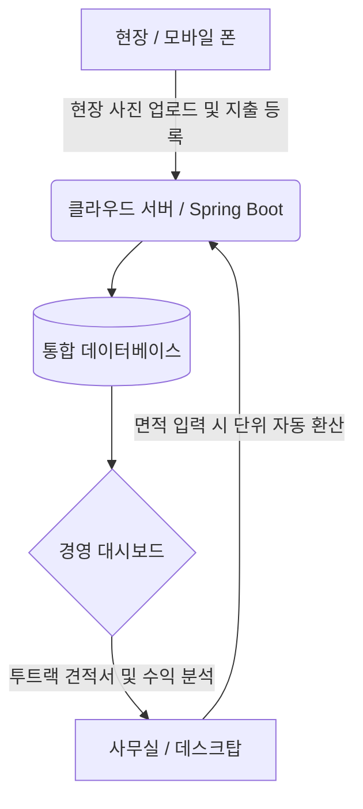

# 2026-06-28 작성자: PROCPA

# [기획안] 소상공인 맞춤형 하이브리드 인테리어 관리 시스템 설계

## 1. 개요 및 목표
본 기획안은 도면 기반의 정밀한 '물량 적산 기능'과 현장의 자금 흐름을 통제하는 '경영 관리(ERP) 기능'을 하나로 결합한 '하이브리드 인테리어 관리 시스템'의 구축을 목표로 합니다.
- **주요 타겟**: 1인 기업 및 소규모 인테리어 업체
- **개발 전략**: 크로스 플랫폼 (Electron + Web 기반 하이브리드)

## 2. 시스템 핵심 관리 목표 (자금 흐름 통제)
단순한 견적서 작성을 넘어, 인테리어 현장의 자금 흐름과 원가 누수를 방지하는 구조적 장치를 마련합니다.
- **실행가 vs 견적가 대조**: 고객에게 제출하는 '견적가'와 실제 현장에 투입되는 '원가(실행가)'를 분리하여 프로젝트의 마진율을 실시간으로 추적합니다.
- **정산 및 미수금 관리**: 공정별 기성 청구 현황과 하도급 업체(작업자/자재상)에게 지급해야 할 미지급금을 대시보드와 그래프로 시각화합니다.
- **데이터 파이프라인**: `견적 -> 계약 -> 실행예산 편성 -> 일일 지출/매입 등록 -> 현장별 최종 수익 분석`의 흐름으로 설계되어 흑자 부도를 예방합니다.

## 3. 핵심 기능 통합 전략
현장 실무에 꼭 필요한 기능들을 크로스 플랫폼 환경에서 다음과 같이 융합합니다.

### 3.1. [적산/견적] 정밀한 적산 엔진 및 스마트 편의성
- **스마트 단위 자동 환산기 (핵심 기능)**: 가로×세로 면적(㎡)만 입력하면, 장판(m, 평), 벽지(롤), 타일(박스) 등 각 공정 및 자재의 유통 특성에 맞춰 실무 단위로 자동 환산하여 필요 물량을 도출합니다.
- **자재 마스터 및 일위대가 연동**: 엑셀 형식의 직관적인 그리드(Grid) UI를 통해 물량을 빠르게 입력하고, 표준 품셈 데이터를 즉각적으로 끌어와 데스크탑 생산성을 극대화합니다.
- **투트랙 견적서 출력 (고객용/실행용 분리)**: 시스템 내부 실행가에서는 자재비와 인건비를 명확히 분리하되, 고객에게 출력해 줄 때는 인건비를 자재비에 태워 '통견적(평당 단가)' 형태로 변환하여 출력하는 기능을 지원합니다.

### 3.2. [경영/현장] ERP 수준의 현장 관리 능력
- **현장 사진 실시간 동기화 (클라우드)**: 모바일 앱(또는 모바일 웹)으로 현장에서 촬영한 사진이 해당 공정의 견적/정산 내역에 즉시 매칭됩니다.
- **수익성 대시보드 시각화**: 각 현장별 미수금, 미지급금 현황을 원형/막대그래프로 시각화하여 대표자가 재무 건전성을 직관적으로 파악할 수 있도록 돕습니다.

## 4. 크로스 플랫폼(Cross-Platform) 아키텍처 설계
개발 및 유지보수 비용을 최소화하기 위해 '원소스 멀티유즈(One-Source Multi-Use)' 전략을 채택합니다.

### 4.1. 기술 스택 (Technical Stack)
- **Frontend (UI/UX)**: Vite 기반의 React.js (반응형 웹 SPA 설계)
- **Desktop App**: Electron (웹 뷰를 감싸는 형태, 로컬 파일 시스템 제어 및 엑셀 단축키 완벽 지원)
- **Backend & Cloud**: Spring Boot + AWS S3 (사진 저장) + PostgreSQL (안정적인 데이터 관리)
- **Mobile 환경**: 별도의 네이티브 앱(iOS/Android) 설치 없이, 모바일 최적화 웹(PWA)으로 구현하여 사진 업로드 및 현장 조회를 즉시 지원합니다.

### 4.2. 데이터 흐름 구조도

## 5. 단계별 개발 로드맵
안전한 런칭을 위해 3단계로 나누어 개발을 진행합니다.
- **1단계 (MVP 구성)**: 단위 자동 환산기 및 투트랙 견적서 작성을 포함한 핵심 적산 엔진 개발 (데스크탑 웹앱 형태)
- **2단계 (현장 연동)**: 모바일 사진 업로드 연동 및 견적서 사진 첨부 기능 자동화 (하이브리드 동기화)
- **3단계 (ERP 고도화)**: 실행 예산 대조, 미수금/미지급금 관리, 경영 통계 대시보드 구축

---
> [!note] 종합 의견
> 본 기획안은 소상공인들이 수기로 계산하며 가장 피로를 느끼는 **'단위 환산 및 인건비 배분'** 문제를 시스템이 알아서 처리해 주는 스마트 기능을 전면 배치하여 실무 활용도를 극대화했습니다. 강력한 적산 엔진과 현장 관리 능력을 크로스 플랫폼이라는 효율적인 기술로 묶어내어, 단 하나의 프로그램으로 인테리어 업무 전체를 완벽하게 장악할 수 있습니다.
