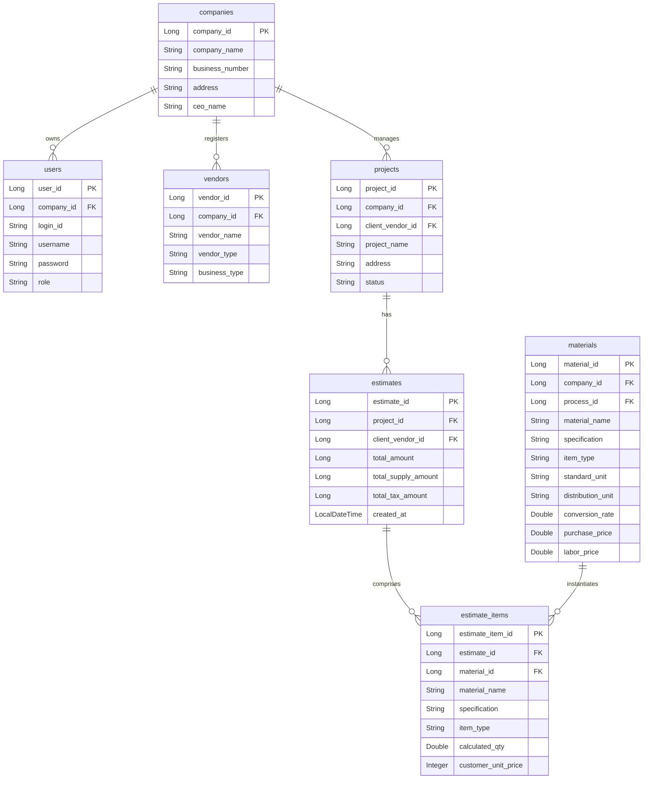

# 2026-06-29 [설계도] 데이터베이스(DB) 구조 및 필드 상세 명세서

본 명세서는 하이브리드 인테리어 관리 시스템의 테이블 아키텍처 및 자재비/노무비 이원화, 현장 상태 잠금 관리, SQLite 지속성 및 data.sql 시드 체계에 대응하기 위한 관계형 DB 설계서입니다.

---

## 1. 개체 관계 다이어그램 (ERD)

---

## 2. DB 구동 환경 및 시드 초기화 정책

### 2.1. 개발 & 데스크탑 환경 SQLite 파일 DB 통일 (`interior.db`)
* **설정 파일:** `application-dev.yml`, `application-desktop.yml`
* **DB URL:** `jdbc:sqlite:${user.home}/AppData/Roaming/InteriorERP/interior.db`
* **설계 의도:** 개발 환경과 오프라인 데스크탑 환경 모두 하나의 SQLite 파일 DB를 공유하여, 서버 재기동이나 HeidiSQL 접속 시에도 사용자 데이터가 100% 지속 저장되도록 보장합니다.

### 2.2. 표준 SQL 시드 파일 (`data.sql`) 및 조건부 스킵 실행
* **시드 파일:** `src/main/resources/data.sql`
* **실행 정책 (`DummyDataLoader.java`):**
  * 백엔드 기동 시 DB 레코드 존재 여부를 체크 (`companyRepository.count() > 0`)
  * **기존 데이터 존재 시:** `data.sql` 시드 주입을 **100% 안전하게 스킵(Skip)**하여 유저 데이터 보존
  * **DB 비어있는 극초기 1회만:** `data.sql` 시드 쿼리를 직접 실행하여 회사, 관리자(`admin`), 기본 공정/자재 마스터 세팅

---

## 3. 주요 테이블별 필드 설명 및 설계 의도

### 3.1. `materials` (자재 및 노무비 마스터 사전) 테이블
* **설계 의도:** 자재와 노무비의 원가 단가를 하나의 마스터 테이블에서 물리적으로 구분하고 격리 등록하도록 튜닝되었습니다.
* **필드 설명:**
  * `material_id` (PK, Long): 자동 번호 생성
  * `material_name` (String, Not Null): 품목명 (예: `고급 이태리 포세린 타일`, `타일공 시공 인건비`)
  * `specification` (String): 규격 및 상세 사양 정보 (예: `600x600`, `실크`, `기공 1인`)
  * `item_type` (String): 품목 구분 값 (`MATERIAL` = 순수 자재비, `LABOR` = 순수 노무/인건비)
  * `standard_unit` (String): 실측/소요 기본 단위 (㎡, m, L, 일 등)
  * `distribution_unit` (String): 발주/유통 단위 (Box, Roll, 일 등)
  * `conversion_rate` (Double): 단위 환산율
  * `purchase_price` (Double): 순수 자재 매입 원가
  * `labor_price` (Double): 순수 노무/인건비 단가

### 3.2. `projects` (공사 현장) 테이블
* **설계 의도:** 현장 진행 수명 주기를 제어하고 완료 시의 영구 데이터 변경 방지 락의 앵커 포인트로 활용됩니다.
* **필드 설명:**
  * `project_id` (PK, Long): 자동 번호 생성
  * `project_name` (String, Not Null): 현장 공사명
  * `status` (String, Default '견적중'): 진행 상태 (`견적중` ➔ `수주` ➔ `공사중` ➔ `완료`)
    * **중요 로직:** `status` 가 `완료` 로 갱신되는 순간 이 현장은 수정 및 추가가 전면 차단(Lock)됩니다.
