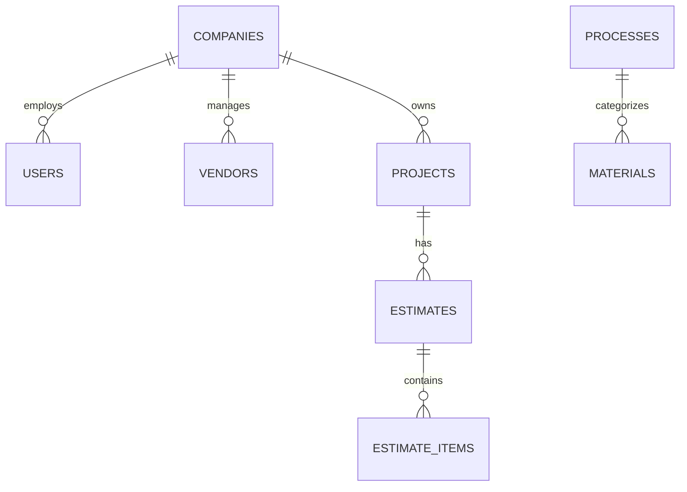

# 2026-06-29 통합 인테리어 관리 시스템 상세 설계 요약 보고서

본 보고서는 XCOST의 정밀한 물량 적산 기능과 IDIS의 자금 흐름 제어(ERP) 강점을 결합한 '소상공인 맞춤형 하이브리드 인테리어 관리 시스템'의 구현 현황 및 시스템 아키텍처 명세서입니다.

---

## 1. 기획안 및 연계 핵심 관리 정책
수기 적산 및 현장 관리 과정에서 발생하는 마진 누수와 휴먼 에러를 시스템 수준에서 원천 봉쇄하는 것을 목표로 설계되었습니다.

* **자재비와 노무비의 물리적 분리 격리:**
  * 하나의 자재 항목에 인건비를 통합하여 관리하던 기존 방식에서 탈피하여, 데이터베이스 테이블 및 입출력 모달 수준에서 '순수 자재 품목'과 '순수 노무비 품목'을 엄격하게 격리 등록 및 관리합니다.
* **단위 동적 바인딩 및 단위 환산 자동화:**
  * 장판(m/평), 실크벽지(롤), 타일(박스), 페인트(L/리터) 등 자재 고유의 실측 단위(`standardUnit`)를 입력 폼과 자동으로 매핑합니다.
  * 자재를 고르면 입력 라벨이 `소요 수량 (L)`, `소요 수량 (m)` 등으로 실시간 치환되어 실무 편의를 높였습니다.
* **완료(정산) 현장의 영구적 데이터 오염 잠금 (Locking):**
  * 공사가 '완료' 상태로 변경되면, 상세 정보 대화상자가 전면 읽기 전용(`ReadOnly`)으로 전환되어 현장명, 주소, 거래처, 진행 상태를 수정할 수 없으며 신규 견적 발행도 영구 차단됩니다.

---

## 2. API & Service 상세 설계도

### 2.1. 자재 마스터 API (`MaterialController.java`)
* `GET /api/materials`: 품목 구분(MATERIAL/LABOR) 및 규격이 포함된 마스터 자재 사전 리스트 조회
* `POST /api/materials`: 신규 자재/노무비 품목 추가
  * 자재(`MATERIAL`) 타입인 경우: 인건비(`laborPrice`)는 0원으로 강제 격리 설정
  * 노무비(`LABOR`) 타입인 경우: 매입원가(`purchasePrice`)는 0원 및 단위 환산율 `1.0` 고정 설정
* `PUT /api/materials/{id}`: 마스터 자재 수정

### 2.2. 견적 시뮬레이터 API (`EstimateController.java`)
* `POST /api/estimates`: 현장 시뮬레이션 기반 견적 생성 및 계산
* `GET /api/estimates/{id}/excel`: 엑셀 다운로드 (Apache POI 연동)
  * **수량, 단가, 공급가액, 세액 및 계(합계) 행** 셀에 천 단위 구분 기호(`#,##0`) 쉼표 스타일 자동 입히기 지원

#### 💡 핵심 견적 금액 계산 공식 (`EstimateService.java`)
* **자재 품목 (`MATERIAL`) 청구 단가 산출식:**
  $$\text{청구 단가} = \text{매입 원가} \times (1 + \text{마진율}) \quad (\text{노무 단가는 0원 처리})$$
* **노무비 품목 (`LABOR`) 청구 단가 산출식:**
  $$\text{청구 단가} = \text{노무 단가} \times (1 + \text{마진율}) \quad (\text{자재 매입 원가는 0원 처리})$$

---

## 3. 데이터베이스(DB) 설계의도 및 테이블/필드 설명
데이터 정합성을 위해 관계형 DB(SQLite / PostgreSQL) 상의 테이블 간 연관관계를 엄격히 조율했습니다.

### 3.1. `materials` (자재/노무비 마스터 사전) 테이블
* **설계 의도:** 자재 규격과 구분 타입을 컬럼으로 직접 제어하여 한 화면에서 자재와 인건비를 명쾌하게 관리하도록 유도합니다.
* **필드 구성:**
  * `material_id` (PK, Long): 고유 식별자
  * `material_name` (String): 자재/노무명
  * `specification` (String) [신설]: 자재 규격 및 품명 상세 정보 (예: `600x600`, `기공 1인`)
  * `item_type` (String) [신설]: `MATERIAL`(자재비) / `LABOR`(노무비/인건비) 구분값
  * `standard_unit` (String): 기본 실측 단위 (㎡, m, L, 일 등)
  * `distribution_unit` (String): 유통/발주 단위 (Box, Roll, 일 등)
  * `conversion_rate` (Double): 단위 환산 계수 (노무비는 1.0)
  * `purchase_price` (Double): 매입 원가 (자재용)
  * `labor_price` (Double): 노무 단가 (인건비용)

### 3.2. `projects` (현장/프로젝트) 테이블
* **설계 의도:** 현장 진행 상태에 따른 수정/삭제 권한 통제의 기준으로 사용됩니다.
* **필드 구성:**
  * `project_id` (PK, Long): 고유 식별자
  * `project_name` (String): 공사 현장명
  * `status` (String): 진행 상태 (`견적중` / `수주` / `공사중` / `완료`)

---

## 4. UI 메인 메뉴 구조도 (React SPA Router)
반응형 웹 및 Electron 데스크톱 창의 구조를 일관성 있게 구성한 네비게이션 트리맵입니다.

* **[루트 네비게이션]**
  * ├─ **📊 대시보드 (`/`)**
  * │  └─ 현장별 미수금, 미지급금 요약 차트 렌더링 (경영 핵심 지표)
  * ├─ **🔨 현장 목록 관리 (`/projects`)**
  * │  ├─ CRM 칸반 보드 (진행상태별 현장 카드 드래그 & 드롭 제어)
  * │  └─ **현장 상세 모달 팝업** (완료 현장 조회 시 락 기능 포함)
  * ├─ **📝 스마트 견적 시뮬레이터 (`/estimate`)**
  * │  ├─ 자재/인건비 종류 검색 (자동완성 및 단위 동적 라벨링)
  * │  ├─ 소요 수량(면적/길이/일수) 기입 및 장바구니 리스트업
  * │  └─ 투트랙 견적서 및 엑셀 다운로드 단추
  * ├─ **💵 정산 및 매입 관리 (`/settlement`)**
  * │  └─ 공정별 실행 원가 입력 및 기성금/미지급금 일일 지출 현장 정산
  * ├─ **📂 마스터 데이터 관리 (`/master`)**
  * │  ├─ **[자재 단가]** 탭: 자재/노무 구분 필터링이 포함된 마스터 사전 테이블
  * │  ├─ **[거래처]** 탭: CLIENT(발주처) 및 SUPPLIER(자재상/작업자) 정보 관리
  * │  └─ **[공정]** 탭: 공사 공정 대분류 관리
  * └─ **⚙️ 시스템 설정 (`/settings`)**
     └─ 회사 기본 프로필 정보 관리 및 구독 관리
