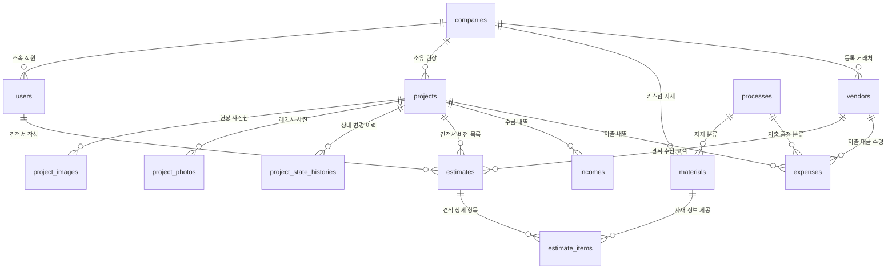

# 통합 데이터베이스(DB) 설계 및 필드 상세 명세서
**최종 수정일:** 2026-08-03  
**작성자:** PROCPA (3개 DB 명세서 통합본)

---

## 1. DB 구동 환경 및 시드 초기화 정책

### 1.1. 로컬 & 데스크탑 환경 SQLite 파일 DB 통일 (`interior.db`)
* **설정 파일:** `application-dev.yml`, `application-desktop.yml`
* **DB URL:** `jdbc:sqlite:${user.home}/AppData/Roaming/InteriorERP/interior.db`
* **설계 의도:** 오프라인/로컬 환경에서 구동하는 단독형 앱(Electron)의 데이터 연속성을 위해 SQLite 파일 기반 DB를 사용합니다.

### 1.2. 표준 SQL 시드 파일 (`data.sql`) 및 조건부 스킵 실행
* **시드 파일:** `src/main/resources/data.sql`
* **실행 정책 (`DummyDataLoader.java`):**
  * 서버 기동 시 DB 레코드 존재 여부를 체크 (`companyRepository.count() > 0`).
  * 기존 데이터가 존재할 시 `data.sql` 시드 주입을 **전면 스킵(Skip)**하여 기존 유저 데이터를 안전하게 보존합니다.
  * DB가 완전히 비어있는 최초 1회만 시드 데이터를 실행하여 기본 회사 정보, 관리자 계정, 공정 및 기초 자재 목록을 세팅합니다.

---

## 2. 개체 관계 다이어그램 (ERD)

---

## 3. 테이블별 상세 설계 명세

### 3.1. `companies` (회사 마스터 테이블)
* **설계 의도:** 멀티 테넌트(SaaS) 환경을 제어하고 견적서 상단에 고정 인쇄되는 '공급자(사업자) 정보' 및 요금제를 관리합니다.
* **필드 명세:**
  * `company_id` (PK, Long, Auto_Increment): 회사 고유 식별자.
  * `company_name` (String, Not Null): 상호명.
  * `ceo_name` (String): 대표자명.
  * `business_number` (String): 사업자등록번호.
  * `address` (String): 사업장 주소.
  * `tel` (String): 대표 전화번호.
  * `fax` (String): 팩스 번호.
  * `business_type` (String): 업태.
  * `business_item` (String): 종목.
  * `subscription_plan` (String, Not Null): 요금제 (LITE, STANDARD, PREMIUM).
  * `created_at` (LocalDateTime): 등록 일시.

### 3.2. `users` (사용자/직원 계정 테이블)
* **설계 의도:** 개별 임직원의 로그인 계정과 메뉴 열람 권한을 제어합니다.
* **필드 명세:**
  * `user_id` (PK, Long, Auto_Increment): 계정 고유 식별자.
  * `company_id` (FK, Long, Not Null): 소속 회사 ID (`companies` 참조).
  * `username` (String, Not Null): 사용자 실명.
  * `login_id` (String, Not Null, Unique): 로그인 아이디.
  * `password` (String, Not Null): 암호화된 패스워드.
  * `role` (String, Not Null): 권한 등급 (`ADMIN` = 사장/관리자, `STAFF` = 일반 직원).
  * `created_at` (LocalDateTime): 등록 일시.

### 3.3. `projects` (공사 현장 테이블)
* **설계 의도:** 공사 수주 현장 정보를 담는 핵심 폴더 역할을 하며, '완료' 상태 설정 시 데이터 잠금(Lock)의 트리거가 됩니다.
* **필드 명세:**
  * `project_id` (PK, Long, Auto_Increment): 현장 고유 식별자.
  * `company_id` (FK, Long, Not Null): 소유 회사 ID (`companies` 참조).
  * `client_vendor_id` (FK, Long): 발주처(고객) 거래처 ID (`vendors` 참조).
  * `project_name` (String, Not Null): 현장 공사명 (예: 서초 래미안 리모델링).
  * `address` (String): 현장 소재지 주소.
  * `status` (String, Not Null): 진행 상태 (`ESTIMATING` / `CONTRACTED` / `IN_PROGRESS` / `COMPLETED` 등).
  * `start_date` (LocalDate): 공사 시작 예정일.
  * `end_date` (LocalDate): 공사 종료 예정일.
  * `created_at` (LocalDateTime): 등록 일시.

### 3.4. `project_images` (현장 사진 테이블 - 활성)
* **설계 의도:** 모바일 PWA 환경에서 실시간으로 업로드된 현장 시공 및 도면 사진을 관리합니다.
* **필드 명세:**
  * `image_id` (PK, Long, Auto_Increment): 이미지 고유 식별자.
  * `project_id` (FK, Long, Not Null): 해당 현장 ID (`projects` 참조).
  * `image_url` (String, Not Null, length=1000): S3 클라우드 스토리지 파일 최종 주소.
  * `original_file_name` (String, Not Null): 사용자가 업로드한 원래 파일명.
  * `uuid_file_name` (String, Not Null, length=100): 저장용 고유 UUID 파일명 (덮어쓰기 방지).
  * `uploaded_at` (LocalDateTime): 업로드 일시.

### 3.5. `project_photos` (현장 사진 테이블 - 레거시/비활성)
* **설계 의도:** 시공 전/후 사진 비교 등 추가 모듈을 위해 생성된 비활성 테이블입니다. (DB 스키마는 존재하나 비즈니스 로직에서는 미사용).
* **필드 명세:**
  * `photo_id` (PK, Long, Auto_Increment): 레거시 사진 식별자.
  * `project_id` (FK, Long, Not Null): 해당 현장 ID (`projects` 참조).
  * `photo_type` (String, Not Null): 사진 유형 (`BEFORE` / `AFTER`).
  * `original_file_name` (String, Not Null): 원본 파일명.
  * `stored_file_name` (String, Not Null): UUID 저장 파일명.
  * `file_url` (String, Not Null): 파일 접근 경로.
  * `uploaded_at` (LocalDateTime): 업로드 일시.

### 3.6. `project_state_histories` (현장 상태 변경 이력 테이블)
* **설계 의도:** 현장 진행 단계의 히스토리를 로깅하고, 어떤 직원이 상태를 전환시켰는지 추적합니다.
* **필드 명세:**
  * `history_id` (PK, Long, Auto_Increment): 변경 이력 식별자.
  * `project_id` (FK, Long, Not Null): 해당 현장 ID (`projects` 참조).
  * `from_status` (String): 변경 전 진행 상태 (최초 등록 시 Null).
  * `to_status` (String, Not Null): 변경 후 진행 상태.
  * `changed_by` (FK, Long): 상태 변경 주체 사용자 ID (`users` 참조).
  * `created_at` (LocalDateTime): 변경 일시.

### 3.7. `processes` (공정 대분류 테이블)
* **설계 의도:** 공사 단계를 분류하고, 무작위로 입력된 견적 내역을 출력 시 공사 순서대로 정렬해주는 기준판입니다.
* **필드 명세:**
  * `process_id` (PK, Long, Auto_Increment): 공정 식별자.
  * `process_name` (String, Not Null): 공정명 (예: 철거공사, 타일공사 등).
  * `sort_order` (Integer): 출력/정렬 우선순위 번호.

### 3.8. `materials` (자재/노무 마스터 사전 테이블)
* **설계 의도:** 자재/노무 품목의 기준정보 및 유통 단위 환산 계수를 지니는 데이터 사전입니다.
* **필드 명세:**
  * `material_id` (PK, Long, Auto_Increment): 품목 식별자.
  * `company_id` (FK, Long): Null일 경우 공용 마스터 자재, 값이 존재할 경우 해당 회사 커스텀 자재.
  * `process_id` (FK, Long, Not Null): 속한 공정 대분류 ID (`processes` 참조).
  * `material_name` (String, Not Null): 품목/노무명.
  * `specification` (String): 상세 규격 (예: `600x600`, `기공 1인`).
  * `item_type` (String, Not Null): 품목 구분 (`MATERIAL` = 순수 자재, `LABOR` = 순수 인건비/노무비).
  * `standard_unit` (String, Not Null): 실측 기준 단위 (㎡, m, 일 등).
  * `distribution_unit` (String, Not Null): 유통/발주 단위 (Box, Roll, 일 등).
  * `conversion_rate` (Double, Not Null): 단위 환산 배율 (예: 1 Box = 1.44㎡ 면적 커버 시 `1.44` 등록).
  * `purchase_price` (Integer, Not Null): 순수 자재 매입 원가 (노무비의 경우 0).
  * `labor_price` (Integer, Not Null): 순수 노무 단가 (자재의 경우 0).

### 3.9. `estimates` (견적서 마스터 테이블)
* **설계 의도:** 고객과의 최종 합의 이력을 차수별로 통제하며, 전체 계약금액 집계의 기준이 됩니다.
* **필드 명세:**
  * `estimate_id` (PK, Long, Auto_Increment): 견적서 식별자.
  * `project_id` (FK, Long, Not Null): 해당 현장 ID (`projects` 참조).
  * `client_vendor_id` (FK, Long): 수령인(고객) 거래처 ID (`vendors` 참조).
  * `author_user_id` (FK, Long, Not Null): 작성자 계정 ID (`users` 참조).
  * `version` (Integer, Not Null): 견적 수정 차수.
  * `is_final` (Boolean, Not Null): 계약 확정 최종 견적서 여부.
  * `total_amount` (Integer, Not Null): 전체 청구 합계 금액 (마진율 적용 완료된 최종가).
  * `margin_rate` (Double, Not Null): 사장 수동 설정 마진율 (예: 20% 마진 적용 시 `0.2`).
  * `created_at` (LocalDateTime): 견적 작성 일시.

### 3.10. `estimate_items` (견적 상세 내역 테이블)
* **설계 의도:** 견적서 내부의 세부 품목 내역입니다. 단위 자동 환산 결과와 사내 원가(자재/노무)가 기록됩니다.
* **필드 명세:**
  * `item_id` (PK, Long, Auto_Increment): 내역 고유 식별자.
  * `estimate_id` (FK, Long, Not Null): 해당 견적서 ID (`estimates` 참조).
  * `material_id` (FK, Long, Not Null): 원본 품목 정보 ID (`materials` 참조).
  * `input_area` (Double, Not Null): 사장님이 입력한 현장 실측량 (㎡, m 등).
  * `calculated_qty` (Double, Not Null): 자동 단위 환산된 발주 필요량 (올림 적용).
  * `material_cost` (Integer, Not Null): 자재비 매입 원가 (`calculated_qty * purchase_price`).
  * `labor_cost` (Integer, Not Null): 인건비 투입 원가 (`calculated_qty * labor_price`).
  * `customer_unit_price` (Integer, Not Null): 고객에게 공개 청구되는 항목 단가 (투트랙 변환가).

### 3.11. `incomes` (수금 내역 테이블)
* **설계 의도:** 기성 수금 현황을 추적하여 미수금을 파악하고, 할인 네고(할인액) 이력을 별도 관리합니다.
* **필드 명세:**
  * `income_id` (PK, Long, Auto_Increment): 수금 고유 식별자.
  * `project_id` (FK, Long, Not Null): 대상 현장 ID (`projects` 참조).
  * `amount` (Integer, Not Null): 통장에 들어온 실제 현금 수금액.
  * `discount` (Integer): 고객에게 해준 할인/네고 금액.
  * `income_date` (LocalDate, Not Null): 수금 처리일.
  * `type` (String, Not Null): 수금 회차 구분 (계약금, 중도금, 잔금 등).
  * `created_at` (LocalDateTime): 등록 일시.

### 3.12. `expenses` (지출/매입 내역 테이블)
* **설계 의도:** 자재상 송금 대금 및 작업 인건비 일당 정산금을 기록하여 현장의 실제 마진을 대조 산출합니다.
* **필드 명세:**
  * `expense_id` (PK, Long, Auto_Increment): 지출 고유 식별자.
  * `project_id` (FK, Long, Not Null): 대상 현장 ID (`projects` 참조).
  * `process_id` (FK, Long): 지출이 속한 공정분류 ID (`processes` 참조, 선택 사항).
  * `vendor_id` (FK, Long, Not Null): 송금 대상 지급처 ID (`vendors` 참조).
  * `amount` (Integer, Not Null): 실제 집행된 지출액.
  * `expense_date` (LocalDate, Not Null): 지출 집행일.
  * `created_at` (LocalDateTime): 등록 일시.

### 3.13. `vendors` (거래처 마스터 테이블)
* **설계 의도:** 수금 대상 고객, 자재 거래상, 외주 인력 반장님의 연락처 및 송금 계좌 정보를 통합 관리합니다.
* **필드 명세:**
  * `vendor_id` (PK, Long, Auto_Increment): 거래처 고유 식별자.
  * `company_id` (FK, Long, Not Null): 해당 거래처를 소유한 회원사 ID (`companies` 참조).
  * `vendor_type` (String, Not Null): 구분 (`CLIENT` = 수금처/고객, `SUPPLIER` = 자재상/매입처, `SUBCONTRACTOR` = 외주/용역업체).
  * `business_type` (String, Not Null): 사업 형태 (`CORPORATION` = 법인, `INDIVIDUAL` = 개인/프리랜서).
  * `vendor_name` (String, Not Null): 거래처명 / 성명.
  * `business_number` (String): 사업자등록번호 또는 주민번호/연락처.
  * `address` (String): 소재지 주소 (견적서 수신처 자동 인쇄용).
  * `contact_person` (String): 담당자 성명 및 직통 연락처.
  * `account_info` (String): 송금용 은행 및 계좌 정보.
  * `created_at` (LocalDateTime): 등록 일시.
