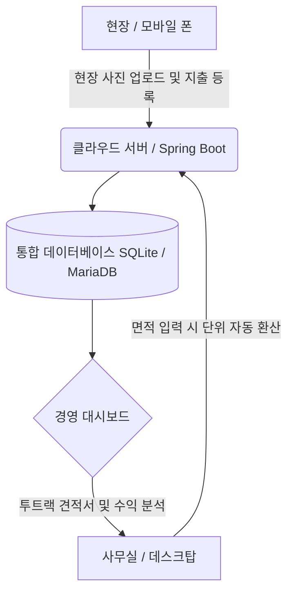

# 통합 하이브리드 인테리어 ERP 및 적산 시스템 설계 사양서
**작성일:** 2026-06-29  
**작성자:** PROCPA (통합 개정판)

---

## 1. 시스템 개요 및 목표
본 시스템은 정밀한 도면 기반 물량 적산에 강점을 가진 **XCOST**의 개념과, 현장의 실시간 자금 흐름(원가/정산)을 통제하는 데 특화된 **이디스(IDIS)**의 ERP 아키텍처를 결합한 **소상공인 맞춤형 하이브리드 인테리어 관리 시스템**입니다.

### 1.1. 주요 타겟 및 목표
* **대상:** 1인 기업 및 소규모 인테리어 업체
* **목표:** 수기 계산 및 현장 관리 과정에서 발생하는 마진 누수와 휴먼 에러를 시스템 수준에서 원천 차단하고, 최종 순이익을 투명하게 모니터링하여 흑자 부도를 예방합니다.
* **아키텍처:** 데스크탑 단독 실행(SQLite + Electron)과 웹/모바일 환경(Spring Boot + MariaDB + AWS S3)을 동시에 지원하는 크로스 플랫폼 설계.

---

## 2. 핵심 비즈니스 및 관리 정책

### 2.1. 자재비와 노무비의 물리적 분리 격리
* 하나의 자재 항목에 인건비를 통합하여 관리하던 기존의 관행을 배제합니다.
* 데이터베이스 테이블 구조 및 UI 입력 모달 수준에서 '순수 자재 품목(MATERIAL)'과 '순수 노무비 품목(LABOR)'을 엄격하게 격리 등록하고 관리합니다.

### 2.2. 단위 동적 바인딩 및 단위 환산 자동화
* **스마트 단위 자동 환산기:** 가로×세로 면적(㎡)만 입력하면 장판(m, 평), 벽지(롤), 타일(박스), 페인트(L) 등 자재 고유의 실측 유통 단위(`standardUnit`)에 맞춰 소요 수량을 자동으로 환산합니다.
* 자재 선택 시 입력 폼의 라벨이 해당 단위에 맞추어 동적으로 치환됩니다.

### 2.3. 완료(정산) 현장의 데이터 오염 잠금 (Locking)
* 프로젝트의 진행 상태가 '완료'로 변경되면, 상세 정보 팝업 및 관련 내역이 전면 읽기 전용(`ReadOnly`)으로 전환됩니다.
* 이 상태에서는 현장명, 주소, 거래처 등 기본 정보 수정 및 신규 견적서 발행이 영구적으로 잠금 처리됩니다.

### 5.4. 8시간 세션 만료 및 백엔드 재부팅 감지
* 보안 및 데이터 정합성을 위해 사용자 로그인 후 **8시간 세션 타임아웃**을 적용합니다.
* 백엔드가 재시작되거나 재빌드될 경우 고유 구동 토큰(`SERVER_BOOT_ID`)의 변경을 프론트엔드가 감지하여 사용자 세션을 즉시 해제하고 자동 로그아웃을 처리합니다.

### 2.5. SQLite 지속성 및 조건부 시드 데이터 세팅
* 로컬 환경 구동 시 SQLite 파일 DB(`interior.db`)를 활용하여 데이터를 영구 보존합니다.
* 데이터베이스에 기존 레코드가 이미 존재하는 경우 `data.sql` 구동을 건너뛰어(Skip) 사용자 데이터 오염을 예방합니다.

---

## 3. 기술 아키텍처 및 스택

### 3.1. 기술 스택 (Technical Stack)
* **Frontend:** React (TypeScript) + Vite 기반 반응형 웹 SPA 설계
* **Desktop App:** Electron (로컬 파일 시스템 제어, 단축키 지원)
* **Backend:** Spring Boot (Java 17, JPA)
* **Database:** 
  * 로컬/데스크탑: SQLite (`org.sqlite.JDBC`)
  * 서버/배포: MariaDB (`org.mariadb.jdbc.Driver`)
* **Cloud & Storage:** AWS S3 (현장 시공 사진 저장)

### 3.2. 데이터 흐름 구조도

---

## 4. 파트별 세부 기능 명세

### [파트 A] 모바일 클라우드 사진 1:N 업로드 연동
* **1:N 이미지 매핑:** 프로젝트 현장(`Project`) 및 공정(`Process`) 하위에 여러 장의 사진을 연결하는 관계형 데이터 구조를 수립합니다.
* **모바일 업로더 컴포넌트:** `<input type="file" accept="image/*" multiple />`을 사용하여 모바일 갤러리 및 도면 사진을 동기화합니다.
* **엑셀 사진첩 출력 자동화:** Apache POI의 `Drawing` 기능을 활용하여 견적 내보내기 시 두 번째 시트에 공정별 시공 전/후 사진첩 레이아웃을 자동으로 렌더링합니다.

### [파트 B] 4대 핵심 경영 통계 대시보드
* **순이익 마진 랭킹:** 현장별 기대 마진 대비 실제 지출을 비교하여 순이익이 높은 현장을 시각화합니다.
* **채권/채무 에이징(Aging) 분석:** 미수금 및 미지급금의 연체 기간을 `30일 이내`, `60일 이내`, `90일 초과` 단위로 분류하여 경영 상태를 분석합니다.
* **주요 거래처 통계:** 누적 거래액이 가장 높은 자재상 및 협력 업체를 분석합니다.
* **공정별 지출 비중:** 전체 지출 중 각 공정(타일, 목공, 도배 등)이 차지하는 비중을 차트화합니다.

### [파트 C] 대용량 리스트 가상 스크롤 (Virtual Scroll) 도입
* **도입 배경:** 수천 개의 자재 데이터나 다량의 현장 목록 렌더링 시 발생하는 브라우저 성능 저하를 방지합니다.
* **대상 화면:** `MasterData.tsx` (자재 그리드 테이블) 및 `EstimateBuilder.tsx` (자재 자동완성 검색 드롭다운).
* **구현 방식:** 화면의 가시 영역(Viewport)에 노출되는 10~20개의 DOM만 렌더링하고, 스크롤 이동에 따라 좌표(`top: index * rowHeight`)와 데이터를 실시간으로 재활용(Recycle)합니다.

---

## 5. API 및 서비스 상세 설계

### 5.1. 사용자 인증 및 세션 관리 (`UserController.java`)
* `POST /api/users/login`: 로그인 처리 및 8시간 유효기간 설정, 서버 구동 토큰(`bootId`) 발급.
* `GET /api/users/session-check`: 서버 재부팅 감지를 위한 토큰 검증 API.

### 5.2. 자재 마스터 API (`MaterialController.java`)
* `GET /api/materials`: 품목 구분(MATERIAL/LABOR) 및 규격이 포함된 마스터 자재 리스트 조회.
* `POST /api/materials`: 신규 자재/노무 품목 추가.
* `PUT /api/materials/{id}`: 마스터 자재 수정.

### 5.3. 견적 시뮬레이터 API (`EstimateController.java`)
* `POST /api/estimates`: 현장 시뮬레이션 기반 견적 생성 및 계산.
* `GET /api/estimates/{id}/excel`: Apache POI 연동 고객/실행 투트랙 엑셀 다운로드.

### 5.4. 현장 이력 현황 API (`SettlementHistoryController.java`)
* `GET /api/settlements/history`: 연도별 전체 현장(`견적중`, `수주`, `공사중`, `완료`) 이력 조회 및 확정 실적/미계약 파이프라인 2원화 지표 산출.

---

## 6. UI 메인 메뉴 및 라우터 구조 (React SPA Router)
* **📊 대시보드 (`/`):** 현장별 미수금, 미지급금 요약 대화상자 및 원형 차트.
* **📈 상세 경영 지표 (`/analytics`):** 계약 현장들의 금융 흐름 추이 및 마진 랭킹 분석.
* **🔨 현장 목록 관리 (`/projects`):** CRM 칸반 보드 및 상세 현장 정보 관리 (완료 현장 ReadOnly 처리).
* **📝 스마트 견적 시뮬레이터 (`/estimate`):** 자재/노무 적산, 단위 동적 환산 및 엑셀 출력.
* **💵 정산 및 매입 관리 (`/settlement`):** 5대 KPI 카드(견적총액, 실제계약금액, 실수금액, 지출원가, 최종순이익) 및 선입선출 일괄 수금.
* **📜 현장 이력 현황 (`/settlement-history`):** 전체 현장 이력 통합 조회 및 동적 연도 검색.
* **📂 마스터 데이터 관리 (`/master`):** 자재 사전, 거래처, 공정 정보 관리 (가상 스크롤 적용).
* **⚙️ 시스템 설정 (`/settings`):** 회사 프로필 및 에이전트 권한 설정.

---

## 7. 단계별 개발 로드맵
* **1단계 (MVP 구성):** 단위 자동 환산기 및 투트랙 견적서 작성을 포함한 핵심 적산 엔진 개발.
* **2단계 (현장 연동):** 모바일 사진 업로드 연동 및 견적서 사진첩 자동 출력 연동.
* **3단계 (ERP 고도화):** 실행 예산 대조, 미수금/미지급금 관리, 경영 통계 대시보드 구축.
